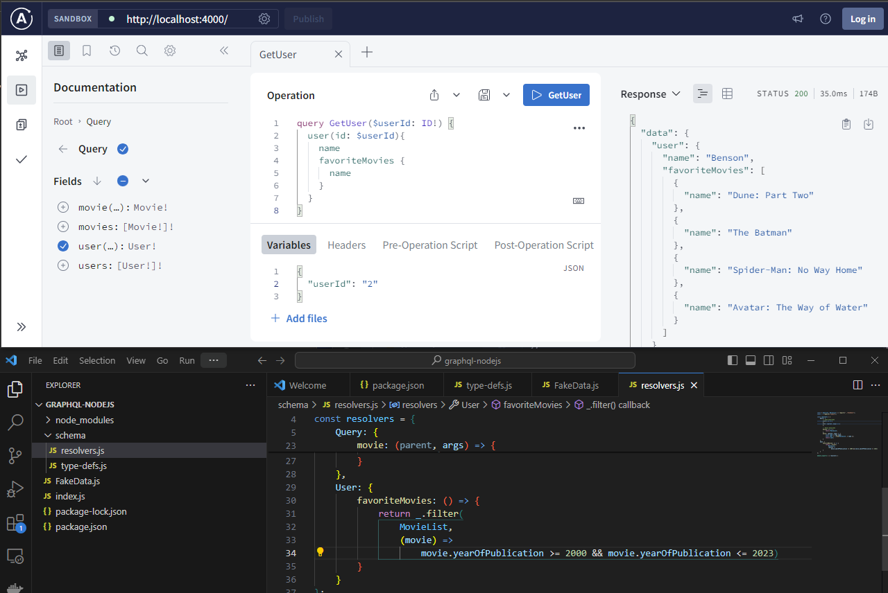
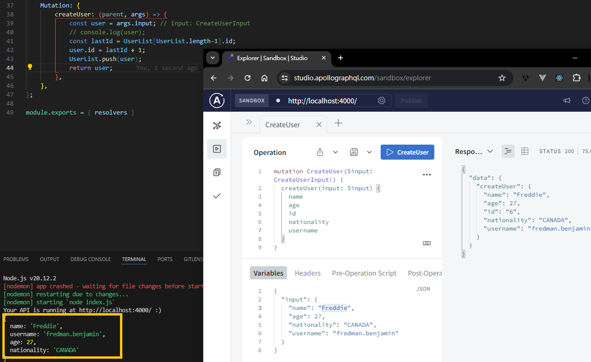
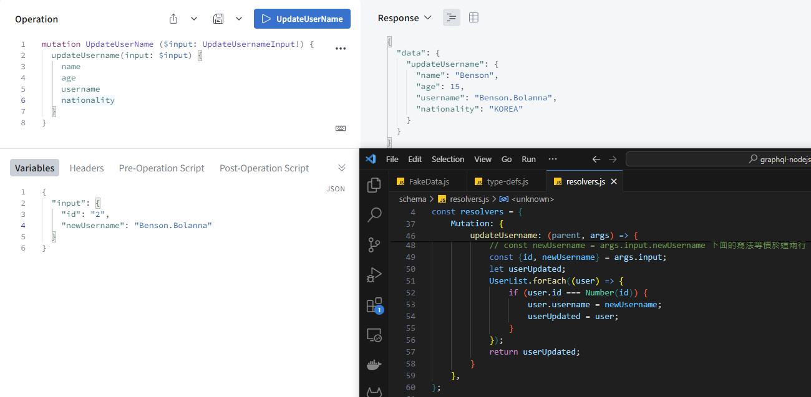
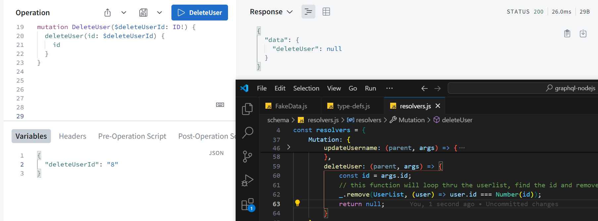
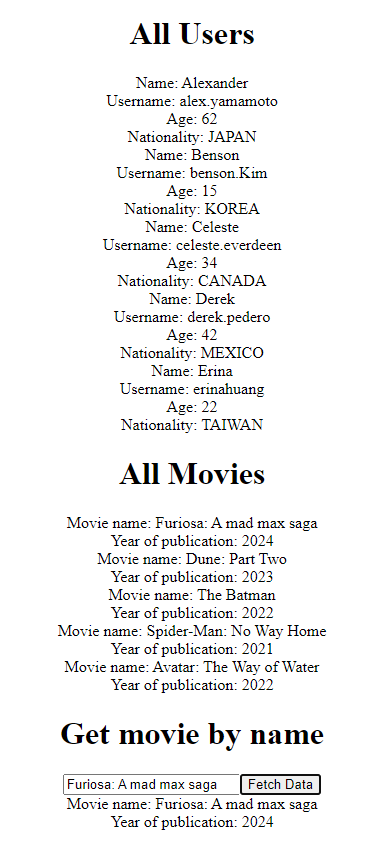
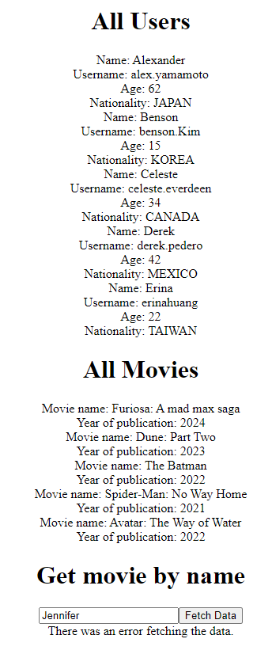

這篇 README 分為兩部分，第一部分說明專案架構以及啟動/驗證/測試步驟，第二部分則是根據 [Youtube tutorials](https://youtube.com/playlist?list=PLpPqplz6dKxXICtNgHY1tiCPau_AwWAJU&si=bcgwV3eVYsUWdzJp) 所做的筆記。

---

## GraphQL - Beginner to Expert
Resources are credited by pedro tech and this playlist seems very insightful so I took notes.

### GraphQL 是什麼
- GraphQL 是一種查詢語言，GraphQL 不等於資料庫
- GraphQL 是介於前端跟後端中間
- Queries an API, not a database 
- 請求有兩種類型 (request, type):
  - Query: `GET`
  - Mutation: `PUT`, `DELETE`, `POST` (資料異動)
- GraphQL can exist in two ways in side of a normal application:
  1. GraphQL come from a completely different separate service from your backend, FE only communicate with GraphQL
  2. GraphQL exist as a part of your backend service.

### GraphQL 與 REST 的差異
- GraphQL 只有一個 endpoint `/graphql`

  | REST       | GQL      |
  |------------|----------|
  | /user      | /graphql |
  | /followers | /graphql |
  | /posts     | /graphql |

- Overfetching / Underfetching
  - 假設你設計了一個網站:
    - Over fetching in RESTFUL: 取得太多不會用到的數據
    - under fetching in RESTFUL: 為了取得追蹤人數, 用戶資料, 發文內容, 發送了一共3支API
- GraphQL 改成讓前端自行指定需要取得的數據

### 範例教你如何使用 GraphQL API 

[UI similar to GraphQL playground](https://countries.trevorblades.com/)

```graphql
type User {
  id: ID!
  name: String!
  age: Int!
  height: Float!
  isMarried: Boolean
  friends: [User!]
  videosPosted: [Video!]
}
type Video {
  id: ID!
  title: String!
  description: String!
}
```
- GraphQL 提供五種基本資料型別: ID, String, Int, Float, Boolean
- 因為資料庫都有ID，太常見所以自成一個資料型別
  > **ID**: 
  > The ID scalar type represents a unique identifier, often used to refetch an object or as key for a cache.
  > The ID type appears in a JSON response as a String; however, it is not intended to be human-readable. 
  > When expected as an input type, any string (such as "4") or integer (such as 4) input value will be accepted as an ID.
- 上述的語法自定義了另外一個 type User
- `!` 表示為必要欄位/不可為null
- `[<custom-defined-type>]` 當某個欄位具有不只一個元素(array)，用中括號表示
- 通常array不會加!表示必填
  - `[User!]`: 不一定要有任何朋友，但是如果有朋友，一定要提供User
  - `[User:!]!`: 一定要有 array (通常array不需要為必填)

- 每個 GraphQL API 都必須要有 schema，這個 schema 跟資料庫的 db schema 不一樣
- 另外會有一個 root type 稱為 Query，裡面放不同查詢(查全部、以ID查單筆)
  ```graphqls
  type Query {
    users: [User]
    user(id: ID): User
  }
  ```
- 例如 Countries GraphQL API schema Query 就長這樣
  ```graphqls
  type Query {
    continent(code: ID!): Continent
    continents(filter: ContinentFilterInput = {}): [Continent!]!
    countries(filter: CountryFilterInput = {}): [Country!]!
    country(code: ID!): Country
    language(code: ID!): Language
    languages(filter: LanguageFilterInput = {}): [Language!]!
  }
  ```
- **input** 關鍵字是將QUERY傳入參數(如果兩個查詢條件或更多) 組織成一個結構的寫法
  ```
  input UserInput {
    id: ID
    name: String
  }
  type Query {
    users: [User]
    user(input: UserInput): User
  }
  type Continent {
    code: ID!
    name: String!
    countries: [Country]
  }
  ```
- 使用以下語法呼叫要執行的 Query，如果要回傳的 TYPE 是定義在 Graphql，則要指定需要那些 field，例如這裡需要 Country type
- 如果需要額外其他的資料 (例如以下範例的 continent)，需要加上大括號放要從這個 type Continent 裡面你想拿到的欄位
 ```
  {
    country(code: "US") {
      code
      name
      phone
      capital
      currency
      continent {
        code
        name
        countries {
          name
          capital
        }
      }
    }
  }
  ```
- 查詢語言且傳入的參數非必填 `={}`

  
  ```
  {
    languages {
      code
      name
      native
      rtl
    }
  }
  ```
#### Reference GraphQL API
[Link to the Countries GraphQL API](https://github.com/trevorblades/countries)

### how to create a GraphQL API (using NodeJS)

~~時間不足，只能先看看~~

Execute below command to start a new nodejs project and install dependencies

```bash
# initializing a nodeJS project
npm init
# hit enters and it will generate package.json for you

npm install apollo-server graphql 
# notice that the dependencies are added to package.json

# install nodemon to prevent server from restarting everytime you make any change
npm install nodemon
```

add a start script to the `package.json` file, so as to run nodemon into our packages

```json
{
  "scripts": {
    "test": "echo \"Error: no test specified\" && exit 1",
    "start": "nodemon index.js"
  }
}
```

create an `index.js` file

import some stuff form apollo-server library

`new ApolloServer()` takes in two parameters:
1. type definition - typeDefs
   - 所有你定義在 graphql 的 type 都在這
2. resolvers
   - 所有對這些 type 做處理的 functions 都在這
   - 例如 make calls to the api, interacting with database

Apollo GraphQL VScode extension is very helpful while composing typeDefs.

Use `module.exports` and `const { } = require( )` to create parameter for this Apollo Server

```bash
npm start
```

Viola! Here's the result!


### GraphQL Resolvers

- Short hand notation for whenever your key is equal to the value
  ```javascript
  _.find(UserList, { id : id });
  _.find({ id });
  ```
  
#### Add user resolvers


#### Add movie resolvers


如果每個 User 會有對應的 favorite movie array，但我們不要直接把 movie detail 全部放進這個 array 怎麼做?

可以透過 creating resolver for the user type 來達成，如下結果



### Mutations

#### 增加 user
- 可以建立一個 input
- 使用 `=` 替必填但沒有input值的欄位加入預設值
  ```graphqls
  input CreateUserInput {
      name: String!
      username: String!
      age: Int = 18 
      nationality: Nationality!
      friends: [User]
      favoriteMovies: [Movie]
  }
  ```
- 驗證結果如下  
  

#### 更新 user 名稱
- 驗證結果如下
  

#### 刪除一筆 user
- 驗證結果如下
  


### UseQuery Hook in Apollo Client

#### 沒有查詢條件 (no input)
1. 將 `graphql-nodejs` 目錄底下的內容拆分成 client 目錄與先前建立的 server 目錄
2. 在 client folder 建立一個 REACT APP
   ```bash
   cd graphql-nodejs/client/

   # this takes a lot of time to download modules
   npx create-react-app . 
   ```
3. 移除不會用到的檔案
   - App.test.js
   - index.css
   - logo.svg
   - setupTests.js
4. @ index.js, remove the `import './index.css';`
5. @ App.js, remove the `import logo from './logo.svg';` and header label which won't be used here
6. Open a terminal, @ client directory, enter command `npm start`, this should prompt a new browser window
7. Open another terminal, @ client directory, enter command `npm install @apollo/client`
8. @ App.js, import ApolloClient, InMemoryCache, ApolloProvider
9. New an Apollo Client with a few parameters (cache and uri)
10. Create a new component named `DisplayData.js`
11. 使用 `gql()` 生成查詢參數，再將查詢參數傳入`useQuery()`函式，會拿到三個回傳值
12. 用 `{ data && data.users.map(...) }` render view
13. 注意如果 query 多個條件，避免重複參數的方式如下 (data assign to movieData)
    ```javascript
    const { data, loading, error } = useQuery(QUERY_ALL_USERS);
    const { data: movieData } = useQuery(QUERY_ALL_MOVIES);
    ```

#### 有查詢條件 (query with input)
1. 透過 create state 達成以名字查詢單筆資料
2. 傳入參數進 `$nameInput` 有兩種方式
   ```js
   // first way:
   const [fetchMovie, {data: movieSearchedData, error: movieError}] = useLazyQuery(GET_MOVIE_BY_NAME, {variable: {nameInput: movieSearched}});
   ```
   ```js
   // second way: pass through function 這裡用的是這個
   // onClick={fetchMovie}
   onClick={() =>{fetchMovie({variables: {nameInput: movieSearched}})}}
   ```
3. 注意 useState 函式是返回一個 array 包含兩個元素，不是返回一個物件包含兩個 field，寫成大括號會拋錯
   ```js
   import React, { useState } from 'react'

   const [ movieSearched, setMovieSearched ] = useState(''); 
   ```
4. 驗證結果如下

   
   
   

#### Note1: What is useQuery hook?
- useQuery 在 Apollo client library 是非常重要的概念，是用來與 Query API 交互取得資料的錨點
- 另外也有 useQueryLazy, useMutation 等等的 Hook

#### Note2: Useful extension: 
VS code
- ES7 React/Redux/GraphQL/React-Native snippets:
  - `rfce` 快速產生一個 functional component template
- Import Cost by Wix:
  - 適用於優化應用程式的大小與性能表現
  - 在 import ... 右邊欄位顯示要引入的模組大小 (e.g. `21k, gzipped: 7.5k)`)

Chrome
- [Apollo Client Devtools](https://chromewebstore.google.com/detail/apollo-client-devtools/jdkknkkbebbapilgoeccciglkfbmbnfm)


### Use Mutation Hook in Apollo Client


### Context, Fragments, Union Result Boxes


---
## Application GraphQL

先不管 npm 跟 node js 了，快回來喝杯 javacano ☕

1. 首先在 Spring initializr 加上以下的 dependencies 並下載 project
   ```
   ✅ Spring for GraphQL [WEB]
   Build GraphQL applications with Spring for GraphQL and GraphQL Java.

   ✅ Spring Boot Actuator [OPS]
   Supports built in (or custom) endpoints that let you monitor and manage your application - such as application health, metrics, sessions, etc.

   ✅ GraphQL DGS Code Generation [DEVELOPER TOOLS]
   Generate data types and type-safe APIs for querying GraphQL APIs by parsing schema files.

   ✅ Netflix DGS [WEB]
   Build GraphQL applications with Netflix DGS and Spring for GraphQL.

   ✅ Spring Web [WEB]
   Build web, including RESTful, applications using Spring MVC. Uses Apache Tomcat as the default embedded container.

   ✅ PostgreSQL Driver [SQL]
   A JDBC and R2DBC driver that allows Java programs to connect to a PostgreSQL database using standard, database independent Java code.
   ```
2. 調整 application 設定檔並加入其它會用到的 dependencies
   - scalars 用來加入 `ExtendedScalars`
   - micrometer 用來收集 metrics 並將收集到的指標送進監控工具 (Prometheus, Graphite, Datadog) 做可視化分析
   - subscriptions-websockets 使用 websocket 實現 GraphQL 訂閱
   - datafaker 用來生成各種格式/類型的假資料, 可以做單元測試的數據, 或模擬用戶行為做性能測試
   ```groovy
   implementation 'com.netflix.graphql.dgs:graphql-dgs-extended-scalars'
   implementation 'com.netflix.graphql.dgs:graphql-dgs-spring-boot-micrometer'
   implementation 'com.netflix.graphql.dgs:graphql-dgs-subscriptions-websockets-autoconfigure'
   implementation 'net.datafaker:datafaker:1.9.0'
   ```
